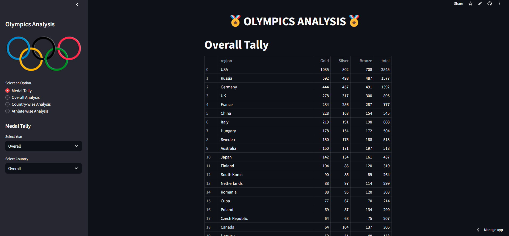

# Olympic-data-analysis

This project is a Streamlit web application for the analysis of olympics dataset.

Datasets: athlete_events.csv and noc_regions.csv
Dataset Link: https://www.kaggle.com/heesoo37/120-years-of-olympic-history-athletes-and-results

## Overview of the project:- 

## Overall Medal Tally:

## Overall analysis:

## Countrywise analysis - India:

## Athlete wise analysis:

command to run the application :  py -m streamlit run app.py

Some more analysis available on app
